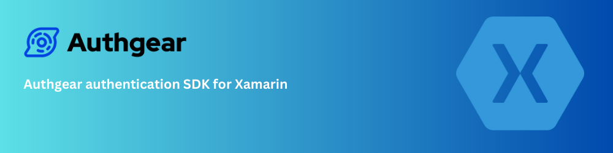

# Authgear SDK for Xamarin

With Authgear SDK for Xamarim, you can easily integrate authentication features into your Xamarin apps.
In most cases, it involves just **a few lines of code** to enable **multiple authentication methods**, such as [social logins](https://www.authgear.com/features/social-login), [passwordless](https://www.authgear.com/features/passwordless-authentication), [biometrics logins](https://www.authgear.com/features/biometric-authentication), [one-time-password (OTP)](https://www.authgear.com/features/whatsapp-otp) with SMS/WhatsApp, and multi-factor authentication (MFA).

**Quick links** - 📚 [Documentation](#documentation) 🏁 [Getting Started](#getting-started) 🛠️ [Troubleshooting](#troubleshooting)
👥 [Contributing](#troubleshooting)

## What is Authgear?

[Authgear](https://www.authgear.com/) is a highly adaptable identity-as-a-service (IDaaS) platform for web and mobile applications.
Authgear makes user authentication easier and faster to implement by integrating it into various types of applications - from single-page web apps to mobile applications to API services.

### Key Features

- Zero trust authentication architecture with [OpenID Connect](https://openid.net/developers/how-connect-works/) (OIDC) standard.
- Easy-to-use interfaces for user registration and login, including email, phone, username as login ID, and password, OTP, magic links, etc for authentication.
- Support a wide range of identity providers, such as [Google](https://developers.google.com/identity), [Apple](https://support.apple.com/en-gb/guide/deployment/depa64848f3a/web), and [Azure Active Directory](https://azure.microsoft.com/en-gb/products/active-directory/) (AD).
- Support biometric login on mobile, Passkeys, and Multi-Factor Authentication (MFA) such as SMS/email-based verification and authenticator apps with TOTP.

## Documentation

- View the SDK API Reference at [https://authgear.github.io/authgear-sdk-xamarin/](https://authgear.github.io/authgear-sdk-xamarin/).
- Learn how to manage your users through [Admin Portal](https://portal.authgear.com/) or [Admin API](https://docs.authgear.com/reference/apis/admin-api).
- NuGet Gallery: https://www.nuget.org/packages/Authgear.Xamarin/

View other Authgear Documentation at [https://docs.authgear.com/](https://docs.authgear.com/)

## Getting Started

Follow the easy steps to start using it:

- [Getting started with Authgear Xamarin SDK](https://docs.authgear.com/get-started/native-mobile-app/xamarin)

## Build

### Prerequisites

- Xamarin workload (Android + iOS) in Visual Studio
- [Docfx](https://dotnet.github.io/docfx/tutorial/docfx_getting_started.html) (for doc generation)

## Known Limitation

### Build

The sample project can be built on both windows and macOS. The sample has a dependency on the library project, and building the sample would build the library automatically.

However, for packaging the library (e.g. in CICD), since the library project is using [MSBuild.Sdk.Extras](https://github.com/novotnyllc/MSBuildSdkExtras) for its single project, multi-targeting feature (that allows targeting Xamarin.iOS and Xamarin.Android at once within the same project), the project needs a "Desktop msbuild" to package the library. `dotnet pack` or `dotnet msbuild` would not work (it would complain needing desktop msbuild). **Since "Desktop msbuild" is only available on windows, currently, only windows is capable of packaging the library.** 

Current CI already uses windows image and packs the resultant nuget package as a github action artifact so developers shouldn't need to pack the library on their own.

.NET 6's [sdk style project](https://docs.microsoft.com/en-us/dotnet/standard/frameworks) natively support single project, multi-targeting for `net6.0-android`, `net6.0-ios` and can be built, packed with `dotnet build` and `dotnet pack` on both windows and macOS. But adopting it would obviously force customers to migrate to .NET 6, so that route was not taken. When appropriate, future upgrades to this SDK can simply revert `MSBuild.Sdk.Extras` to `Microsoft.NET.Sdk` and multi-target .NET 6+ mobile TFMs.

## Demo Apps

Two demo apps are included in the Github repo under `XamarinFormSample/`. They demonstrate the key features of the SDK on Android and iOS.

### XamarinFormSample.Android

To build the Android app:

1. Open the repo in Visual Studio
1. Make sure "Android SDK Build-Tools 31" is installed.
1. Plug in an Android device in USB debugging mode
1. Select **XamarinFormSample.Android \> Debug \> Your Device** in the top bar and Press Run
1. The demo app will be transferred to your device.

### XamarinFormSample.iOS

To build the iOS app:

1. Open the repo in Visual Studio
1. you need to select a **Provisioning Profile**
1. Right-click "XamarinFormSample.iOS" in the left bar and click "Options"
1. Go to "Build" and "iOS Bundle Signing", select a valid provisioning profile or choose **"Automatic"** for the desired "Configuration" and "Platform" and press "OK" to save the settings
1. Open "Info.plist" and set an appropriate "Bundle identifier"
1. Select **XamarinFormSample.iOS \> Debug \> Your Device** in the top bar and Press Run

## Troubleshooting

Please check out our [Get help](https://github.com/orgs/authgear/discussions/categories/get-help) to get solutions for common installation problems and other issues.

### Raise an issue

To provide feedback or report a bug, please [raise an issue on our issue tracker](https://github.com/authgear/authgear-sdk-xamarin/issues).

## Contributing

Anyone who wishes to contribute to this project, whether documentation, features, bug fixes, code cleanup, testing, or code reviews, is very much encouraged to do so.

To join, just raise your hand on the [Authgear Discord server](https://discord.gg/Kdn5vcYwAS) (#trouble) or the GitHub Authgear's [discussion](https://github.com/orgs/authgear/discussions) board.

If you are unfamiliar with how to contribute to GitHub projects, here is a [Getting Started Guide](https://docs.github.com/en/get-started/quickstart/contributing-to-projects). A full set of contribution guidelines, along with templates, are in progress.

## Supported and maintained by

  

  Auhgear is a highly adaptable identity-as-a-service (IDaaS) platform for web and mobile applications. To learn more checkout <a href="https://www.authgear.com/">website</a>

